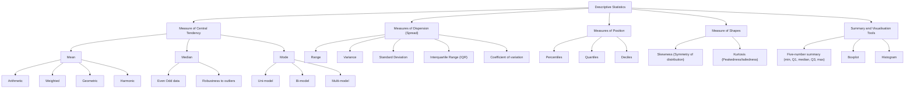

# Mind Map
- Descriptive statistics
  - Measure of Central Tendency
    - Mean
      - Arithmetic
      - Weighted
      - Geometric
      - Harmonic
    - Median
      - Even - Odd data
      - Robustness to outliers
    - Mode
      - Uni-model
      - Bi-model
      - Multi-Model
  - Measures of Dispersion (Spread)
    - Range
    - Variance
    - Standard Deviation
    - Interquaartile Raannge (IQR)
    - Coefficient of variation
  - Measures of Position
    - Percentiles
    - Quartiles
    - Deciles
  - Measure of Shapes
    - Skewness (Symmetry of distribution)
    - Kurtosis (Peakedness/tailedness)
  - Summary and Visualisation Tools
    - Five-number summary (min, Q1, median, Q3, max)
    - Boxplot
    - Histogram
   
      
- Inferential Statistics
  - Fundamentals
    - Population vs Sample
    - Sampling Methods
      - Random
      - Stratified
      - Cluster
      - Systematic
    - Sampling Distribution
    - Law of Large Numbers and Central Limit Theorem
  - Estimation
    - Point Estimation (Sample mean, proportion)
    - Interval Estimation (Confidence intervals)
  - Hypothesis testing
    - Null vs Alternative Hypotheses
    - Type 1 and Type 2 errors
    - p-values
    - Significance levels
    - Power of a test
    - Statistical Tests
      - Parametric Test
        - t-tests (Independent, Paired, One-sample)
        - z-test
        - f-test (Variance comparison)
        - ANOVA (One-way, Two-way)
      - Non-Parametric Test
        - Chi-Square Test (Goodness-of-fit, Independence)
        - Mann-Whitney U
        - Wilcoxon
        - Kruskal-Wallis
    - Regression and Correlation
      - Correlation
        - Pearson
        - Spearman
        - Kendall
      - Linear Regression
      - Logistic Regression
      - Assumptions of Regression
    - Advanced Topics
      - Effect Size
      - Resampling Methods (Bootstrapping, Jackknife, Permutation tests)
      - Bayesian Inference (priors, posteriors, Bayes’ theorem)
    
# Descriptive statistics
- Measure of Central Tendency
It's all about finding the centre value in a dataset.  
    - Mean
      | Type of Mean        | Formula                                  | Example                                                       | Strength / Use Case                                                                 | Weakness / Notes                                                  |
      |---------------------|------------------------------------------|---------------------------------------------------------------|-------------------------------------------------------------------------------------|-------------------------------------------------------------------|
      | **Arithmetic Mean** | AM = (Σxᵢ) / n                           | Salaries = [50k, 60k, 70k] → (50+60+70)/3 = 60k                | Simple average, easy to interpret.                                                   | Sensitive to outliers. If one salary is 500k, the mean jumps.   |
      | **Weighted Mean**   | WM = (Σwᵢxᵢ) / (Σwᵢ)                     | GPA calculation → course grades weighted by credit hours.      | Useful when values have different importance (e.g., weighted revenue per customer).  | Requires weights; misleading if weights are poorly chosen.      |
      | **Geometric Mean**  | GM = (x₁ × x₂ × … × xₙ)^(1/n)            | Stock growth: 10%, 20%, 30% → GM ≈ 19.7%                       | Best for multiplicative processes (growth rates, ratios).                           | Cannot handle negative values.                                    |
      | **Harmonic Mean**   | HM = n / (Σ(1/xᵢ))                       | Speed: 60 km/h (1 hr), 30 km/h (1 hr) → HM = 40 km/h           | Good for rates (speed, efficiency). In ML, F1-score = harmonic mean of precision and recall. | Overly influenced by very small values.                  |

    - Median
      - Even - Odd data
        - Odd dataset: Middle element.
Example: [3, 5, 8] → Median = 5.
        - Even dataset: Average of two middle values.
Example: [3, 5, 8, 10] → Median = (5+8)/2 = 6.5.
      - Robustness to outliers
        - Median is resistant to outliers/skewed data.
        - Example: Salaries [50k, 60k, 500k] → Median = 60k (much better than mean = 203k).
    - Mode
      - Uni-model: One clear peak.
Example: [2, 2, 3, 4, 5] → Mode = 2.
      - Bi-model: Two peaks.
Example: [2, 2, 3, 4, 4, 5] → Modes = 2 and 4.
      - Multi-Model: More than two peaks.
Example: [2, 2, 3, 3, 4, 4, 5] → Modes = 2, 3, 4.
  - Measures of Dispersion (Spread)

| Measure                           | Formula                                | Example                                                                                  | Advantages (easy words)                                              | Disadvantages (easy words)                                             |
|-----------------------------------|----------------------------------------|------------------------------------------------------------------------------------------|----------------------------------------------------------------------|------------------------------------------------------------------------|
| **Range**                         | Range = Max(x) – Min(x)               | Salaries = [50k, 60k, 70k, 500k] → 500k – 50k = 450k                                     | Very simple, quick to calculate.                                     | Extremely sensitive to outliers; not reliable alone.                    |
| **Variance (σ² or s²)**           | σ² = Σ(xᵢ – μ)² / N  (population)  s² = Σ(xᵢ – x̄)² / (n–1) (sample) | Dataset [2, 4, 6] → Mean = 4 → Variance = ((2–4)² + (4–4)² + (6–4)²)/3 = 2.67            | Shows how spread out the data is; useful in stats & ML.              | Units are squared → not very intuitive.|
| **Standard Deviation (σ)**        | σ = √Variance                          | From above: √2.67 ≈ 1.63                                                                 | Most common measure; in same units as data → easy to interpret.      | Still affected by outliers.                                            |
| **Interquartile Range (IQR)**     | IQR = Q3 – Q1                       | Dataset [1,2,3,4,5,6,7,100] → Q1=2.5, Q3=6.5 → IQR=4                                     | Focuses on middle 50% of data; resistant to outliers/skewness.       | Ignores extreme values (may miss some patterns).                          |
| **Coefficient of Variation (CV)** | CV = σ / μ                     | Product A: Mean=1000, SD=50 → CV=0.05 Product B: Mean=200, SD=40 → CV=0.20            | Unit-free; good for comparing variability across different scales.   | Not meaningful if mean ≈ 0 or negative.                                        |

  - Measures of Position
    
| Measure         | Formula / Definition                                  | Example                                                                                  | Advantages (easy words)                                              | Disadvantages (easy words)                                  |
|-----------------|-------------------------------------------------------|------------------------------------------------------------------------------------------|----------------------------------------------------------------------|-------------------------------------------------------------|
| **Percentiles** | Pₖ = value below which k% of data falls            | Dataset = [10,20,30,40,50], 20th percentile (P20) → 10.8 (interpolated)                 | Shows relative position in data; easy to understand; good for comparisons. | Doesn’t show spread or range; may require interpolation.  |
| **Quartiles**   | Q1 = 25%, Q2 = 50% (median), Q3 = 75%              | Dataset = [5,7,8,12,15,18,20] → Q1=7, Q2=12, Q3=18; IQR = Q3-Q1 = 11                     | Divides data into 4 parts; useful for detecting outliers; robust to extreme values. | Ignores extreme values outside the middle 50%.      |
| **Deciles**     | Divide data into 10 equal parts                     | Dataset = [5,10,15,…50] → D1=9.5, D5≈27.5 (median)                                     | Finer segmentation than quartiles; good for ranking users.          | Can be overkill for small datasets; may need interpolation.      |

  - Measure of Shapes
    - Skewness (Symmetry of distribution)
    - Kurtosis (Peakedness/tailedness)
  - Summary and Visualisation Tools
    - Five-number summary (min, Q1, median, Q3, max)
    - Boxplot
    - Histogram
